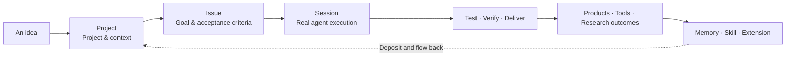
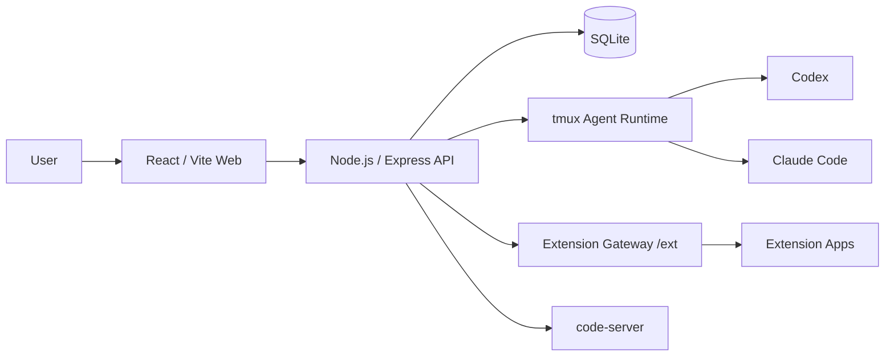

<a id="readme-top"></a>

<p align="right">
  <sub>
    <a href="./README.md">简体中文</a> · <b>English</b>
  </sub>
</p>

<h1 align="center">
  <a href="https://mobius.nutshellai.cn/">
    
  </a>
  <br/>
  Mobius · Mobius AgenticOS
</h1>

<p align="center">
  <strong>Not an ordinary AI assistant — a production system that grows.</strong>
  <br />
  <sub>Always-On · Self-Evolving · Human-Friendly · Self-Incubating</sub>
</p>

<p align="center">
  
</p>

<p align="center">
  
  
  
  
  <br/>
  <a href="https://mobius.nutshellai.cn/"></a>
  <a href="./LICENSE"></a>
  
</p>

<p align="center">
  <a href="https://mobius.nutshellai.cn/"><strong>Website</strong></a>
  ·
  <a href="#what-can-you-do-with-it">What You Can Do</a>
  ·
  <a href="#seven-capabilities">Seven Capabilities</a>
  ·
  <a href="#working-model">Working Model</a>
  ·
  <a href="#xiaomo-assistant">XiaoMo Assistant</a>
  ·
  <a href="#quickstart">Quickstart</a>
  ·
  <a href="#developer-guide">Developer Guide</a>
  ·
  <a href="#license">License</a>
</p>

---

## What is Mobius?

> **A ship of Theseus that continuously reshapes itself around your needs.**

Mobius is an enterprise-grade AgenticOS for real-world project collaboration. The system places projects, tasks, execution sessions, and context management inside a single Web app — letting you submit requirements directly in the platform, create Issues, launch Sessions, and let Agents complete implementation, verification, and reporting inside the bound directory.

Most agents leave their output outside the conversation. Mobius reabsorbs code, knowledge, Memory, Skill, Extension, and research outcomes back into system capability. It is both building products for you and using those products to rebuild itself.

```diff
- Perceive → Plan → Execute → Reflect → Task ends → Back to origin
+ Perceive → Plan → Execute → Reflect → Output deposited ↻ One layer up
```

<table>
  <tr>
    <td width="33%" align="center">
      <strong>♾️ Always Connected</strong>
      <br />
      <sub>Runs on a weekly cadence<br />Supports multiple projects 7×24</sub>
    </td>
    <td width="33%" align="center">
      <strong>🧬 Cross-Dimensional</strong>
      <br />
      <sub>From completing tasks to reshaping the system<br />Every iteration becomes the starting point of the next</sub>
    </td>
    <td width="33%" align="center">
      <strong>✨ Stellar Output</strong>
      <br />
      <sub>Continuously produces code, tools, and apps<br />Products and traceable research outcomes</sub>
    </td>
  </tr>
</table>

### GLM-5.2 × Mobius — The strongest open-source coding model × a complete Agent workstation

> GLM-5.2 (**Code Arena global #1** · SWE-Bench Pro 62.1% · 1M Token real context) is currently the open-source coding model closest to Claude Opus.
>
> Mobius is the first Web workstation that lets GLM-5.2 fully drive Agent Sessions via the Z.AI-compatible interface — no Anthropic account needed, one Key, and you can run a coding Agent comparable to Opus inside the Project / Issue / Session closed loop.

### A Growing Production Loop



<p align="right"><a href="#readme-top">Back to top ↑</a></p>

## What You Can Do with It

<table>
  <tr>
    <td width="33%" valign="top">
      <strong>🚀 Solo dev / one-person company efficiency</strong>
      <br/>
      <sub>One person, multiple parallel tracks</sub>
    </td>
    <td width="33%" valign="top">
      <strong>⚡ Rapid product development</strong>
      <br/>
      <sub>From requirement to runnable product</sub>
    </td>
    <td width="33%" valign="top">
      <strong>🔬 Multi-agent research</strong>
      <br/>
      <sub>Assemble a team, collaborate asynchronously</sub>
    </td>
  </tr>
</table>

**Solo developer / one-person company efficiency**

One person, multiple parallel tracks. Receive requirements in natural language via the XiaoMo assistant; it auto-decomposes them into projects and tasks. Multiple Agent Sessions execute in parallel inside their own isolated workspaces — you only confirm at key milestones. Through aimux remote compute, Agents can run on your local hardware without keeping the screen watched.

**Rapid product development with full UI**

From requirement description to runnable product, entirely inside the Web UI. The platform ships with several ready-made product examples built using Mobius itself, ready as starting points for further development or reference:

| Example | Description |
|---|---|
| 📊 PPT generator | Generate presentable PPT from natural language |
| 📰 Finance news wall | Real-time fetching and visualization |
| 🧩 JSON visualizer | Interactive browsing of complex structures |
| 🌌 3D physics simulation | Physics engine + frontend rendering |

The Extension system lets you ship a standalone app with UI and backend logic without modifying the main code.

**Multi-agent research collaboration**

After enabling Research mode, you can assemble an Agent team: one Chief Researcher coordinates planning, multiple Assistants execute sub-topics in parallel, collaborate asynchronously via a shared blackboard, and the results are automatically aggregated into a visual research graph. Suitable for scenarios that require multiple sources of information to converge, such as technology selection, competitive analysis, and literature review.

<p align="right"><a href="#readme-top">Back to top ↑</a></p>

## Seven Capabilities

The seven capabilities are not isolated features — they are different stages of the same production loop. Click any capability to see the full description.

<details>
<summary><strong>01 · Always-On</strong> <code>ALWAYS ON</code> — Let agents drive projects forward on a weekly cadence</summary>

Long-horizon operation is not stretching a single conversation longer; it is letting agents truly enter a project and continuously work, verify, and deliver. Mobius carries long-running tasks through Projects, Issues, Sessions, and run records — without relying on a single ad-hoc conversation to hold state.

- Track multiple projects simultaneously, with development, testing, and analysis continuing across day and night.
- Record messages, run markers, stage results, and failure info — execution state is always traceable.
- Modify code, run tests, inspect results, and continue the next iteration inside the bound workspace.
- Detect long-running stalls and trigger a "whipping" mechanism to push progress.
- Users can inspect progress, supplement requirements, take over tasks, or accept results at any time.

What Mobius cares about is not how polished a single answer is, but how much a project has actually moved forward after a week.

</details>

<details>
<summary><strong>02 · Truly Self-Evolving</strong> <code>SELF EVOLVING</code> — Reshape the system while completing tasks</summary>

Mobius breaks self-evolving agents into three actionable layers:

1. **User-driven**: Users request improvements, the system organizes tasks and executes development, and the change is deposited into the new version.
2. **Information-driven**: Continuously corrects judgment and direction by ingesting web material, project documentation, and historical tasks.
3. **Cognitive-driven**: Combines understanding of system, users, and projects to propose improvements the user has not yet thought of but worth pursuing.

Mobius itself also exists as a normal project (`imac-self-develop`). Platform improvements can be implemented, verified, and iterated through the same Issue / Session flow — without leaving the Web UI to write code separately. After proposing a task, confirming Session execution, and waiting for the Agent to complete, you can continue reviewing and iterating inside the same system.

Code, Memory, Skill, Extension, research conclusions, and working methods all flow back along the Möbius loop, becoming part of the system itself.

</details>

<details>
<summary><strong>03 · Team Collaboration</strong> <code>TEAM WORKFLOW</code> — Let every idea enter the same handoff-ready production line</summary>

Mobius's team collaboration is more than "everyone sees the same project" — it ensures every member's idea can be accepted, organized, executed, and handed off by intelligent agents.

- **Automatic context injection**: Project background, historical tasks, Memory, Skill, and the code workspace are injected and snapshotted when a Session is created.
- **Structured handoff**: Task progress can be summarized into briefs for the next member or agent to continue executing.
- **Parallel isolation**: Different tasks can run in separate workspaces, reducing interference from concurrent edits.
- **Permission and audit**: Centrally manage project visibility, members and user groups, read/write/execute permissions, and cross-user operation records.

When an agent takes over, it already understands the project state — the human team can save their attention for direction, decisions, and acceptance.

</details>

<details>
<summary><strong>04 · Agent Formation</strong> <code>MULTI AGENT</code> — Tackle complex problems via division of labor, alignment, and relay</summary>

For complex research and hardcore development, Mobius can organize multi-agent division of labor. Each agent executes sub-tasks in its own isolated workstation and workspace, asynchronously aligns through shared information and structured results, and finally converges into a more complete outcome.

The backend hosts Codex / Claude Code and similar models through the tmux-based Agent backend. Sessions record messages, status, run markers, completion results, and failure info. The system also retains a "whipping" mechanism for detecting long-stalled or seemingly slacking agents and pushing them forward.

In research scenarios, a formation can cover decomposition, parallel retrieval, evidence consolidation, converge-while-advancing, research graphs, and final output. The research process preserves not only conclusions but also the path of "how the question evolved into the conclusion".

The same set of capabilities can also serve as a project war room:

- Multiple agents relay a single product line;
- Multiple technical tracks attack the same hard problem in parallel;
- Complete decision analysis and due diligence from different angles;
- Broadcast stage outcomes to the next batch of executors.

</details>

<details>
<summary><strong>05 · Compute Fleet</strong> <code>COMPUTE FLEET</code> — Turn a cluster of machines into one "big machine"</summary>

Mobius can manage remote compute nodes (aimux), including host registration, hardware spec probing, and connection status testing, so that heavy tasks are no longer limited to a single machine.

When the task load is heavy enough, work can be split and dispatched to multiple remote machines, letting agent formations run on top of the compute cluster. Typical scenarios include:

- Large-scale data processing and batch regression testing;
- Massive document parsing, indexing, and information extraction;
- Enterprise-grade simulation, rendering, and computational experiments;
- Parallel development validation across multiple projects and technical tracks.

Compute is no longer a fixed machine inventory — it is a production resource dynamically organized around tasks.

</details>

<details>
<summary><strong>06 · Multi-Endpoint Friendly Interaction</strong> <code>HUMAN FRIENDLY</code> — Strict backend, natural frontend</summary>

XiaoMo is Mobius's unified interaction Agent. It understands the current page, Project, Issue, and Session, can search projects, complete requirements, and help users create follow-up work.

For ambiguous requests, XiaoMo first offers candidate options and operation guidance; once the information is confirmed, it translates the idea into a structured Project, Issue, and Session. Complex context organization and execution configuration are handled by the system — the user only needs to propose ideas, confirm execution, and accept results.

As Web, desktop, and mobile entry points converge, the interaction stays simple while the backend continues to run on a stable project structure.

</details>

<details>
<summary><strong>07 · Self-Incubating Products</strong> <code>PRODUCT INCUBATION</code> — Let an idea settle into an iterable asset</summary>

Mobius outputs more than answers — it produces real results that can be used, iterated, and extended:

- Web pages, tools, and automated apps;
- Research reports, research graphs, and decision materials;
- Personal apps, team systems, and enterprise internal platforms;
- Reusable Skills, Memories, and Extensions.

Extensions have independent frontend, backend capabilities, and data spaces, while Mobius unifies entry, permissions, and execution environment. An original idea can enter a project, become a task, and settle into a product asset through real execution.

**What you see is what you get. What you imagine can grow.**

</details>

<p align="right"><a href="#readme-top">Back to top ↑</a></p>

## Working Model

Mobius's basic structure is `Project → Issue → Session`.

<table>
  <tr>
    <td width="33%" valign="top">
      <strong>01 · Project</strong>
      <br />
      Workspace and long-term context container. Binds to a code directory, carries project-level Memory, Skill, Research settings, and a context whitelist.
    </td>
    <td width="33%" valign="top">
      <strong>02 · Issue</strong>
      <br />
      A clear task unit. Describes goal, scope, constraints, and acceptance criteria, turning ideas into work that can be executed and verified.
    </td>
    <td width="33%" valign="top">
      <strong>03 · Session</strong>
      <br />
      One real Agent execution. Pins model, language, context snapshot, initial instructions, run logs, and final result.
    </td>
  </tr>
</table>

> [!NOTE]
> When a Session is created, the current Issue, project context, Skill, and Memory are snapshotted. Subsequent changes to global configuration will not drift the context of an already-created Session.

### Memory, Skill, and Research

- **Memory** stores high-frequency, environment-related, private, or volatile information — e.g. startup commands, deployment caveats, SSH hosts, internal service addresses, account references, API key locations.
- **Skill** stores stable, reusable Agent craft — e.g. Playwright debugging, image-generation techniques, Mobius extension development specs, research-graph generation methods.
- **Research** is managed alongside Issues and is suited for multi-stage investigation, material aggregation, research graphs, and Chief Researcher / Research Assistant role division. When Research is enabled, the project does not use the Issue worktree by default.

User-level context can be controlled via project whitelists; project-level Memory and Skill serve that project by default.

### Extension

Extensions live in `mobius/extension/<extension_name>/`. The frontend is rendered via the project page, backend capabilities are uniformly proxied and isolated via `/ext`, and runtime data is stored under `${CORE_DATA_PATH}/extension/<extension_name>`.

The repository already ships with multiple extension examples — marketing pages, mobile, paper reading, PPT generation, data visualization, mini-games, and business demos.

<p align="right"><a href="#readme-top">Back to top ↑</a></p>

## XiaoMo Assistant

XiaoMo is a globally-mounted floating project assistant. It is not a normal Project or Issue — every user has one persistent user-level Agent Session.

The first time you open XiaoMo, you need to configure the model, Skill, and Memory it uses. Once configured, all subsequent XiaoMo conversations enter the same persistent XiaoMo Agent Session, and the frontend periodically refreshes XiaoMo messages and state.

XiaoMo currently provides these capabilities:

- Understands the current page state — current route, current Project, Issue, Session, and the visible projects, Issues, and Sessions on the page.
- Searches user-visible Projects and Issues.
- Creates Projects, Issues, and Sessions once information is confirmed as sufficient.
- For ambiguous requests, provides 2–4 clickable candidates instead of guessing.
- Helps users choose new-project mode, Issue type, and Session execution mode via guided options.
- Returns a clickable action card on success and refreshes the frontend Project / Issue / Session lists.
- Supports a "self-shaping" mode: when a user describes a problem they want to fix in XiaoMo or Mobius, XiaoMo creates the corresponding Issue and Session in a fixed self-evolution project, awaiting the user to open and confirm execution.

XiaoMo still respects an important boundary: it can create Sessions but does not auto-start business Agents. Execution still requires the user to enter the Session and confirm startup.

### Tour System

The tour system is built on Driver.js and stable `data-tour` markers. The frontend splits the complete flow into multiple segmented tours based on the current route, visible modals, and local Demo state, and continues running across pages.

<details>
<summary><strong>View the three specific tour routes</strong></summary>

1. **Birthday Invite Demo**

   Auto-triggered on first login. It walks users through the minimal closed loop of Project, Issue, Session: create a static birthday-invite-page project, create the "make a static birthday invite page" Issue, create the "generate birthday invite page file" Session, guide the user to start execution in the confirmation dialog, and finally clean up the demo project.

2. **Import Existing Project Demo**

   Demonstrates how to put existing code into a Mobius project. The case uses the public TodoMVC repo and shows two import methods: drag-and-drop local files via VSCode Web, or create an Issue with a Git address and constraints and let the Agent fetch and organize them inside a Session.

3. **Memory / Skill / Remote Compute Configuration Demo**

   Demonstrates project-level context configuration. It walks users through the difference between Memory and Skill, the user-level context whitelist, adding project Memory, opening the aimux remote compute authorization entry, and creating a context-check Session to verify the Skill / Memory snapshot.

Tour state is saved in the browser's localStorage. Closing, completing, or deleting the demo project ends the corresponding Demo state. Light mode keeps Driver.js's default highlight; dark and purple modes only add a light outline to avoid heavy visual interference.

> **Current state**: The Birthday Invite Demo is already auto-triggered via the first-login flow; the Import Project Demo and Context Setup Demo have their startup functions and event listeners in place, but the explicit UI entry has not yet been wired to the XiaoMo panel or navigation buttons.

</details>

<p align="right"><a href="#readme-top">Back to top ↑</a></p>

---

## Developer Guide

<p>
  
  
  
  
  
  
</p>

### System Architecture



### Quickstart

#### Option A: Container install and run (recommended)

```bash
# 1. Clone the repo
git clone https://github.com/nutshellai-tech/mobius.git
cd mobius

# 2. Build the base image (env only, no code)
docker build -t imac-mobius-base:latest -f deploy/Dockerfile .

# 3. Build the exec image (with code copied in)
docker build -t imac-mobius-exe:latest .

# 4. Launch
docker compose up
```

#### Option B: Local development

System dependencies: `tmux`, Node.js `18+`, Python 3, and at least one Agent CLI (Codex or Claude Code).

```bash
git clone https://github.com/nutshellai-tech/mobius.git
cd mobius

cp .env.example .env
# Edit .env, fill in API Key, JWT_SECRET, and local paths
```

On first launch, `python3 start.py` automatically initializes missing users from
`IMAC_BOOTSTRAP_USERS` in `.env` / `.env.default`; existing users are not overwritten.
After initialization it writes `MOBIUS_DATA_PATH/bootstrap-users.json` with only
`IMAC_BOOTSTRAP_USERS`; subsequent starts skip the user bootstrap step when the
flag value matches.

To run user initialization separately, use:

```bash
cd mobius
IMAC_BOOTSTRAP_USERS="admin:your-strong-password:admin:Administrator" \
  DB_PATH=<your_local_data>/mobius.db \
  WORKSPACE_ROOT=<your_local_data>/workspace \
  node scripts/bootstrap-users.js
```

> Container deployments run this through `docker-entrypoint.sh`; direct deployments run it through `python3 start.py`. The `IMAC_BOOTSTRAP_USERS` format is `id:password:role:display_name`, with multiple users separated by `;`.

Go back to the repo root and launch the dev environment:

```bash
cd ..
python3 start.py --detach
```

Default dev service ports:

| Service | URL |
|---|---|
| Web frontend | `http://localhost:45616` |
| Backend API | `http://localhost:45614` |
| aimux bridge | `http://localhost:45615` |
| VS Code Web | `http://localhost:45617` |

Frontend build and backend check:

```bash
cd mobius/frontend && npm run build
node -c mobius/backend/routes/assistant.js
```

### Configuration

| Environment variable | Purpose |
|---|---|
| `ANTHROPIC_AUTH_TOKEN` | Claude Code Agent Session driver key |
| `ANTHROPIC_BASE_URL` | Agent API endpoint |
| `ASSISTANT_API_KEY` | XiaoMo chat model key |
| `ASSISTANT_API_BASE` | XiaoMo chat model endpoint |
| `ASSISTANT_MODEL` | Model used by XiaoMo |
| `JWT_SECRET` | JWT signing secret; use a random long string |
| `APP_DIR`, `DB_PATH`, `WORKSPACE_ROOT` | Local code, database, and workspace paths |

Generate a `JWT_SECRET`:

```bash
node -e "console.log(require('crypto').randomBytes(32).toString('hex'))"
```

For full configuration see [API Key setup guide](docs/zhipu-key-setup.md) and [.env.example](.env.example).

### Common Commands

| Operation | Command |
|---|---|
| Frontend build | `cd mobius/frontend && npm run build` |
| Backend syntax check | `node -c mobius/backend/routes/assistant.js` |
| Production-mode restart | `python3 start.py` |
| Attach tmux pane | `tmux attach -t imac-mobius` |

### Project Structure

```text
mobius/
├── mobius/
│   ├── backend/              # API, Agent backend, routes, services
│   ├── extension/            # Mobius extension apps
│   ├── frontend/             # React / Vite Web frontend
│   ├── scripts/              # User bootstrap and maintenance scripts
│   ├── tests/                # Backend and Agent tests
│   ├── package.json          # Node.js backend deps
│   └── server.js             # Backend entry
├── deploy/                   # Podman / Compose deployment config
├── docs/                     # Design, endpoint, path, ops docs
├── scripts/                  # code-server and data migration scripts
├── start.py                  # Local dev launcher
└── Dockerfile
```

### Code Navigation

| Area | Entry |
|---|---|
| XiaoMo frontend panel | `mobius/frontend/src/components/assistant-chat.tsx` |
| XiaoMo backend API | `mobius/backend/routes/assistant.js` |
| Tour controller | `mobius/frontend/src/components/tour-controller.tsx` |
| Driver.js tour logic | `mobius/frontend/src/services/tour.ts` |
| Generic guided-demo state | `mobius/frontend/src/services/guided-demo.ts` |
| Birthday demo state | `mobius/frontend/src/services/birthday-demo.ts` |
| Import-project demo state | `mobius/frontend/src/services/project-import-demo.ts` |
| Context-setup demo state | `mobius/frontend/src/services/context-setup-demo.ts` |
| Project / Issue / Session form prefill | `mobius/frontend/src/components/modals.tsx` |
| Session completion advance guide | `mobius/frontend/src/pages/IssuePage.tsx` |
| Python Agent driver | [mobius/backend/agents_py/README.md](mobius/backend/agents_py/README.md) |

### Documentation

| Doc | What it covers |
|---|---|
| [API Key setup](docs/zhipu-key-setup.md) | Model endpoint and key configuration |
| [Path configuration](docs/path.md) | Container paths, data dirs, and persistence |
| [Extension design](docs/design-ext.md) | Extension frontend/backend structure and isolation |
| [Endpoint reference](docs/endpoint.md) | Backend API and endpoints |
| [Deployment notes](deploy/README.md) | Podman Compose and persistent volumes |

### Deployment

When pulling from GitLab, use an authorized account or pre-configured credentials in the deployment environment. Do not embed passwords directly in commands or docs.

**First deployment:**

```bash
git clone -b agent_smart_dev <gitlab-imac-repo-url> imac
cd imac
cp .env.default deploy/.env
cd deploy
podman compose build
podman compose up
```

**Update deployment:**

```bash
cd imac
git pull
cp .env.default deploy/.env
cd deploy
podman compose build
podman compose down
podman compose up
```

On container start, `docker-entrypoint.sh` automatically initializes users from `IMAC_BOOTSTRAP_USERS`. Data volumes and container paths are documented in [deployment notes](deploy/README.md) and [path configuration](docs/path.md).

### Current Research Notes

> As of 2026-06-08, the project overview documentation needs to be updated. The existing README only covered early bootstrap, the whipping mechanism, Memory/Skill, and deployment fragments, missing the following recent implementation:

- XiaoMo has been upgraded to a persistent user-level Agent Session with configurable model, Skill, and Memory.
- XiaoMo frontend pushes current page state; the backend performs search, creation, and clarification based on page state and tool calls.
- XiaoMo supports a self-shaping entry that can create Issues and Sessions inside the self-evolution project.
- The tour system has expanded from a single Birthday Demo into three routes with state models and segmented logic: Birthday Invite, Import Project, and Context Setup.
- The tour system now supports cross-route/modal segmentation, form prefill, context snapshot explanation, Session completion advance, and demo project cleanup.
- Currently only the Birthday Invite Demo is wired to first-login auto-trigger; the Import Project and Context Setup Demos still need explicit UI entry points.
- The project's overall capabilities also include Research, extension projects, and special apps — these should also be reflected in the overview.

<p align="right"><a href="#readme-top">Back to top ↑</a></p>

---

## License

> [!IMPORTANT]
> Mobius uses a custom Source-Available license. The source code may be used for non-commercial purposes such as learning, research, education, personal projects, and internal evaluation; any commercial use requires separate authorization. See [LICENSE](LICENSE) for the full terms.

Commercial licensing: `business@nutshellai.cn`

---

<p align="center">
  <strong>What you see is what you get. What you imagine can grow.</strong>
  <br />
  <a href="https://mobius.nutshellai.cn/">mobius.nutshellai.cn</a>
</p>

<p align="right"><a href="#readme-top">Back to top ↑</a></p>
