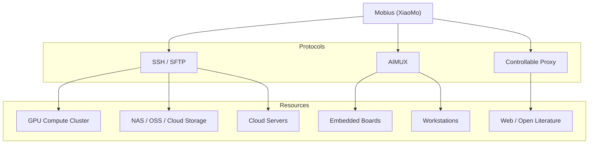

<p align="right">
  <a href="./README.md"><strong>English</strong></a>
  ·
  <a href="./README.zh.md"><strong>简体中文</strong></a>
</p>

<div align="center">

#  Mobius

<h3>
The first self-evolving open-source Agent OS<br />
One system to connect your team, AI agents, devices, and compute
</h3>

<p align="center">
  <a href="https://github.com/nutshellai-tech/mobius/stargazers"></a>
  <a href="https://github.com/nutshellai-tech/mobius"></a>
  <a href="https://mobius.nutshellai.cn/"><strong>Website</strong></a> · <a href="https://nutshellai-tech.github.io/mobius/"><strong>Docs</strong></a>
</p>

</div>

<p align="center">
  
</p>


> **Building a perfect AI system once and for all is like finding the end of a Mobius strip — impossible by design.**
>
> Mobius is the world's first **self-evolving** open-source Agent OS. Not a fixed toolbox — a growing productivity system that connects projects, teams, models, devices, compute, and apps into one traceable workspace.


## Self-Evolving

Mobius rewrites itself from your input. Send a **change request**, a **screenshot**, or a **reference link** — Mobius turns them into real code, UI, plugins, or workflow updates, without interrupting your work. Each iteration replaces a plank on the Ship of Theseus, quietly in the background.

<p align="center">
  
</p>

[View self-evolution examples](https://nutshellai-tech.github.io/mobius/self-evo-demo/)


## Auto Research

Mobius orchestrates multiple agents into an autonomous research pipeline — reading papers, extracting methods, running experiments, and surfacing results. A research goal becomes a multi-agent system, not a single Q&A.

<p align="center">
  
</p>


## XiaoMo

XiaoMo is the natural-language interface to the entire system. Talk to it: create projects, split tasks, launch agents, track progress. Anything clickable, XiaoMo can do. Things the UI cannot do, XiaoMo handles too. Voice input, multi-device (Web, PC, Mobile), configurable reminders.

> The demo videos on this page were produced by XiaoMo itself, with zero human participation in recording.


## Any Model, Any Agent

Mobius is model-agnostic. GPT, Claude, **GLM-5.2**, Codex — all serve as execution engines inside the same project. Choose by task type, cost, or performance.


## Connect Everything

Mobius schedules browsers, terminals, GPU clusters, embedded boards, cloud servers, and workstations — all inside the same task network.

Reach your resources through SSH, AIMUX, and controllable proxies:




## Team Collaboration

Human members, AI agents, tasks, and deliverables in one view. Leads see who is doing what, where each agent is, what needs confirmation, and where risks exist — no more fragmented communication.

<p align="center">
  
</p>


## Self-Incubating Extensions

Build extensions and grows new ones from your needs — financial dashboards, PPT generators, research workbenches, live portals. Each extension comes with a frontend, backend handler, data directory, and invocation entry, ready to keep evolving.

<p align="center">
  
</p>

<table>
  <tr>
    <td width="50%">
      <strong>Immersive Web Experiences</strong><br />
      <sub>Turn visual ideas into runnable extension apps.</sub><br />
      
    </td>
    <td width="50%">
      <strong>Financial News Wall</strong><br />
      <sub>Track live market narratives.</sub><br />
      
    </td>
  </tr>
  <tr>
    <td width="50%">
      <strong>World Cup Portal</strong><br />
      <sub>Data-rich sports portal.</sub><br />
      
    </td>
    <td width="50%">
      <strong>PPT Maker</strong><br />
      <sub>Presentations from topics and materials.</sub><br />
      
    </td>
  </tr>
</table>


## Quick Start

Full deployment guide at [Docs](https://nutshellai-tech.github.io/mobius/).

### Containers (recommended)

```bash
git clone https://github.com/nutshellai-tech/mobius.git && cd mobius
python3 conf_prepare.py --docker && python3 conf_check.py --docker
docker build -t mobius-system-base:latest -f deploy/Dockerfile .
docker build -t mobius-system-exe:latest .
docker compose up
```

### Direct (Linux / macOS)

```bash
sudo apt install tmux python3 git curl proxychains openssh-server build-essential
npm install -g @anthropic-ai/claude-code @openai/codex
git clone https://github.com/nutshellai-tech/mobius.git && cd mobius
python3 conf_prepare.py && python3 conf_check.py
cd ./mobius && npm install && cd ./frontend && npm install && cd ../..
python3 start.py
```


## Roadmap

- **v0.1** — Agent OS foundation: projects, issues, sessions, model integration, agent execution, task management
- **v0.2** — Team collaboration: multi-user projects, permissions, task tracking, agent contribution analytics
- **v0.3** — Self-evolution and extensions: plugin incubation, knowledge accumulation, feedback-driven iteration
- **v0.4** — XiaoMo and multi-agent: natural-language interface, task decomposition, sub-agent collaboration, progress summaries
- **v0.5** — Unify users, AI, devices, compute: remote compute, device access, robot/terminal integration, research pipelines

### Contribution

Issues, plugins, docs, bug reports, use cases — all welcome. If you believe AI systems should evolve instead of being static tools, join us.

<p align="center">
  <a href="https://github.com/nutshellai-tech/mobius">GitHub</a>
  ·
  <a href="https://mobius.nutshellai.cn/">Website</a>
  ·
  <a href="https://nutshellai-tech.github.io/mobius/">Docs</a>
</p>
