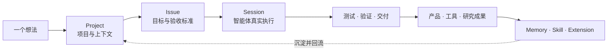
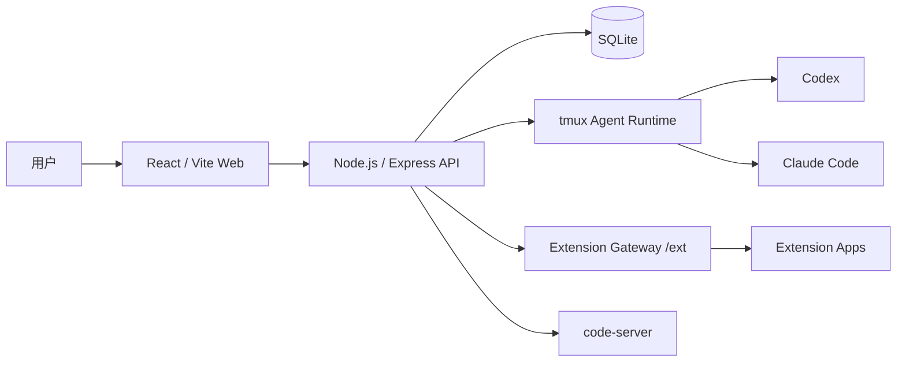

<a id="readme-top"></a>

<p align="right">
  <sub>
    <b>简体中文</b> · <a href="./README.en.md">English</a>
  </sub>
</p>

<h1 align="center">
  <a href="https://mobius.nutshellai.cn/">
    
  </a>
  <br/>
  莫比乌斯 · Mobius AgenticOS
</h1>

<p align="center">
  <strong>不是普通 AI 助手，而是会生长的生产力系统。</strong>
  <br />
  <sub>全天候 · 自进化 · 易交互 · 自孵化</sub>
</p>

<p align="center">
  
</p>

<p align="center">
  
  
  
  
  <br/>
  <a href="https://mobius.nutshellai.cn/"></a>
  <a href="./LICENSE"></a>
  
</p>

<p align="center">
  <a href="https://mobius.nutshellai.cn/"><strong>官方网站</strong></a>
  ·
  <a href="#你能用它做什么">你能用它做什么</a>
  ·
  <a href="#七大能力">七大能力</a>
  ·
  <a href="#工作模型">工作模型</a>
  ·
  <a href="#小莫助理">小莫助理</a>
  ·
  <a href="#快速开始">快速开始</a>
  ·
  <a href="#开发者指南">开发者指南</a>
  ·
  <a href="#许可证">许可证</a>
</p>

---

## 莫比乌斯是什么？

> **一艘按照你的需求持续重塑自己的 AI 忒修斯之船。**

莫比乌斯是一个面向真实项目协作的企业级 AgenticOS。系统把项目、任务、执行会话和上下文管理放在同一个 Web 应用里，让用户可以直接在平台中提出需求、创建 Issue、启动 Session，并让 Agent 在绑定目录里完成实现、验证和汇报。

普通 Agent 的产物通常停留在对话之外；莫比乌斯会把代码、知识、Memory、Skill、Extension 和研究结论重新吸收为系统能力。它既在为你制造产品，也在用这些产品重造自己。

```diff
- 感知 → 规划 → 执行 → 反思 → 任务结束 → 回到原点
+ 感知 → 规划 → 执行 → 反思 → 成果沉淀 ↻ 翻上一层
```

<table>
  <tr>
    <td width="33%" align="center">
      <strong>♾️ 首尾相连</strong>
      <br />
      <sub>以周为单位持续运行<br />支持多个项目 7×24 小时推进</sub>
    </td>
    <td width="33%" align="center">
      <strong>🧬 跨越维度</strong>
      <br />
      <sub>从完成任务走向改造系统<br />让每轮执行成为下一轮的起点</sub>
    </td>
    <td width="33%" align="center">
      <strong>✨ 繁星运转</strong>
      <br />
      <sub>持续产出代码、工具、应用<br />产品与可追溯的科研成果</sub>
    </td>
  </tr>
</table>

### GLM-5.2 × Mobius — 当前最强开源编程模型 × 完整 Agent 工作台

> GLM-5.2（**Code Arena 全球可用第一** · SWE-Bench Pro 62.1% · 1M Token 真实上下文）是目前最接近 Claude Opus 的开源 Coding 模型。
>
> Mobius 是第一个通过 Z.AI 兼容接口，让 GLM-5.2 完整驱动 Agent Session 的 Web 工作台——无需 Anthropic 账号，一个 Key，即可在 Project / Issue / Session 闭环中运行媲美 Opus 的编程 Agent。

### 一条会生长的生产力闭环



<p align="right"><a href="#readme-top">返回顶部 ↑</a></p>

## 你能用它做什么

<table>
  <tr>
    <td width="33%" valign="top">
      <strong>🚀 一人公司 / 独立开发者提效</strong>
      <br/>
      <sub>一个人，多条线同时推进</sub>
    </td>
    <td width="33%" valign="top">
      <strong>⚡ 快速开发软件产品</strong>
      <br/>
      <sub>从需求描述到可运行产品</sub>
    </td>
    <td width="33%" valign="top">
      <strong>🔬 多 Agent 协作调研</strong>
      <br/>
      <sub>组建团队异步协作</sub>
    </td>
  </tr>
</table>

**一人公司 / 独立开发者提效**

一个人，多条线同时推进。用小莫助理自然语言接收需求，自动拆解为项目和任务；多个 Agent Session 在各自独立的工作区里并行执行，你只在关键节点确认启动和验收结果。通过 aimux 远程算力，Agent 可在你的本地机器上运行，无需全程盯屏幕。

**快速开发软件产品，带完整可视化界面**

从需求描述到可运行产品，全程在 Web 界面里完成。平台内置了多个利用 Mobius 自身迭代开发的现成产品示例，可直接作为起点二次开发或参考：

| 示例 | 说明 |
|---|---|
| 📊 PPT 生成器 | 自然语言生成可演示 PPT |
| 📰 财经新闻墙 | 实时抓取与可视化呈现 |
| 🧩 JSON 可视化工具 | 复杂结构交互式浏览 |
| 🌌 3D 物理仿真 | 物理引擎 + 前端渲染 |

Extension 系统允许你在不改动主代码的情况下，快速上线一个带 UI 和后端逻辑的独立应用。

**多 Agent 协作调研**

启用 Research 模式后，可组建 Agent 团队：一名主研究员统筹规划，多名助手并行执行子课题，通过共享黑板异步协作，结果自动汇总到可视化研究图谱。适合技术选型、竞品分析、论文梳理等需要多方信息汇聚的场景。

<p align="right"><a href="#readme-top">返回顶部 ↑</a></p>

## 七大能力

七项能力不是彼此孤立的功能列表，而是同一条生产闭环上的不同环节。点击每项能力可查看完整说明。

<details>
<summary><strong>01 · 全天候运行</strong> <code>ALWAYS ON</code> — 让智能体以周为单位持续推进项目</summary>

长程运行不是把一次对话拖得更久，而是让智能体真正进入项目，持续工作、验证和交付。莫比乌斯通过 Project、Issue、Session 和运行记录承载长任务，不依赖一轮临时对话维持状态。

- 同时跟踪多个项目，让开发、测试和分析跨越昼夜持续推进。
- 记录消息、运行标记、阶段结果和失败信息，执行状态始终可追踪。
- 在绑定工作区中修改代码、运行测试、检查结果并继续下一轮迭代。
- 通过停滞检测和"鞭策"机制识别长期无进展的执行。
- 用户可以随时查看进度、补充要求、接管任务或验收结果。

莫比乌斯关注的不是一次回答有多漂亮，而是一个项目在一周后究竟向前推进了多少。

</details>

<details>
<summary><strong>02 · 真正自进化</strong> <code>SELF EVOLVING</code> — 在完成任务的同时重塑系统</summary>

莫比乌斯把 self-evolving agents 拆成三个可以落地的层级：

1. **用户驱动**：用户提出改进需求，系统组织任务并执行开发，把变化沉淀到新版本中。
2. **信息驱动**：从网络资料、项目文档和历史任务中补充信息，持续修正判断与方向。
3. **认知驱动**：结合对系统、用户和项目的理解，提出用户尚未想到但值得推进的改进。

莫比乌斯自身也作为一个普通项目存在（`imac-self-develop`）。平台改进可以通过同一套 Issue / Session 流程实现、验证和迭代——用户不需要离开 Web UI 单独写代码；提出任务、确认 Session 执行、等待 Agent 完成后，即可在同一个系统里继续验收和迭代。

代码、Memory、Skill、Extension、研究结论和工作方法都会沿着莫比乌斯环回流，成为系统本身的一部分。

</details>

<details>
<summary><strong>03 · 人类团队协作</strong> <code>TEAM WORKFLOW</code> — 让想法进入同一条可交接的生产线</summary>

莫比乌斯的团队协作不只意味着"大家看到同一个项目"，而是让每个人的想法都能被智能体接受、组织、执行和交接。

- **上下文自动注入**：项目背景、历史任务、Memory、Skill 和代码工作区会在 Session 创建时注入并固化。
- **结构化交接**：任务进展能够整理为摘要，交给下一位成员或智能体继续执行。
- **并行隔离**：不同任务可以在独立工作区中推进，降低多人同时修改造成的干扰。
- **权限与审计**：集中管理项目可见性、成员与用户组、读写执行权限和跨用户操作记录。

智能体接手时已经理解项目状态，人类团队可以把注意力留给方向、决策和验收。

</details>

<details>
<summary><strong>04 · 智能体编队</strong> <code>MULTI AGENT</code> — 用分工、对齐和接力推进复杂问题</summary>

面对复杂科研与硬核开发，莫比乌斯可以组织多智能体分工。每个智能体在独立工作站和工作区中执行子任务，通过共享信息与结构化结果异步对齐，最终汇聚为更完整的成果。

后端通过 tmux 系列 Agent backend 托管 Codex / Claude Code 等模型执行。Session 会记录消息、状态、运行标记、完成结果和失败信息。系统还保留了"鞭策"机制，用于发现长时间停滞或疑似偷懒的 Agent 并推动进展。

在科研场景中，编队可以覆盖拆题、并行检索、证据整理、边推进边收敛、研究图谱和最终成果输出。研究过程不只留下结论，还保留"问题如何演化为结论"的路径。

同一套能力也可以成为项目作战室：

- 多个智能体接力完成一条产品线；
- 多条技术路线并行攻坚同一个难题；
- 从不同视角完成决策分析与尽职调查；
- 将阶段成果广播给下一批执行者继续推进。

</details>

<details>
<summary><strong>05 · 算力群体协同</strong> <code>COMPUTE FLEET</code> — 把一群机器组织成一台"大机器"</summary>

莫比乌斯支持纳管远程算力节点（aimux），包括注册主机、探测硬件规格和测试连接状态，让复杂任务不再受限于单台机器。

当任务足够重时，工作可以被拆分并分发到多台远程机器，让智能体编队运行在算力集群之上。典型场景包括：

- 大规模数据处理与批量回归测试；
- 海量文档解析、索引和信息提取；
- 企业级仿真、渲染与计算实验；
- 多项目、多技术路线的并行开发验证。

算力不再是固定机器清单，而是围绕任务动态组织的生产资源。

</details>

<details>
<summary><strong>06 · 多端简易交互</strong> <code>HUMAN FRIENDLY</code> — 后台严谨运行，前台自然表达</summary>

小莫是莫比乌斯内部的统一交互 Agent。它理解当前页面、Project、Issue 和 Session，可以搜索项目、补全需求，并帮助用户创建后续工作。

面对含糊请求，小莫会先给出候选方案和操作引导；信息确认后，再把想法转化为结构化的 Project、Issue 和 Session。复杂的上下文组织和执行配置由系统处理，用户只需要提出想法、确认执行、验收结果。

随着 Web、桌面和移动端入口逐步统一，交互保持简单，后台仍按照稳定的项目结构持续运转。

</details>

<details>
<summary><strong>07 · 自主孵化产品</strong> <code>PRODUCT INCUBATION</code> — 让一次想法沉淀为可迭代资产</summary>

莫比乌斯产出的不只是回答，而是能够继续使用、迭代和扩展的真实结果：

- 网页、工具和自动化应用；
- 研究报告、研究图谱和决策材料；
- 个人应用、团队系统与企业内部平台；
- 可复用的 Skill、Memory 和 Extension。

扩展应用拥有独立前端、后端能力和数据空间，同时由 Mobius 统一管理入口、权限和执行环境。前端位于 `mobius/extension/<extension_name>/frontend`，后端能力通过 Mobius backend 的 `/ext` 统一转发和隔离执行。扩展数据放在 `${CORE_DATA_PATH}/extension/<extension_name>` 下。

一个原始想法可以进入项目、变成任务，再通过真实执行沉淀为产品资产。

**所见即所得，所想可生长。**

</details>

<p align="right"><a href="#readme-top">返回顶部 ↑</a></p>

## 工作模型

Mobius 的基本结构是 `Project → Issue → Session`。

<table>
  <tr>
    <td width="33%" valign="top">
      <strong>01 · Project</strong>
      <br />
      工作空间与长期上下文容器。绑定代码目录，承载项目级 Memory、Skill、Research 设置与上下文白名单。
    </td>
    <td width="33%" valign="top">
      <strong>02 · Issue</strong>
      <br />
      清晰的任务单元。描述目标、范围、约束和验收标准，让想法变成可以执行与验证的工作。
    </td>
    <td width="33%" valign="top">
      <strong>03 · Session</strong>
      <br />
      一次真实 Agent 执行。固定模型、语言、上下文快照、初始指令、运行日志和最终结果。
    </td>
  </tr>
</table>

> [!NOTE]
> 创建 Session 时，当前 Issue、项目上下文、Skill 和 Memory 会固化为快照。之后全局配置发生变化，也不会让已经创建的 Session 上下文漂移。

### Memory、Skill 与 Research

- **Memory** 保存高频、环境相关、私有或容易变化的信息，例如启动方式、部署注意事项、SSH Host、内部服务地址、账号引用、API key 存放位置等。
- **Skill** 保存稳定、可复用的 Agent 技艺，例如 Playwright 调试、图像生成技巧、Mobius 扩展开发规范、Research 图谱生成方法等。
- **Research** 与 Issue 并列管理，适合多阶段调研、资料汇总、研究图谱、Chief Researcher / Research Assistant 分工等场景。启用 Research 时，项目默认不使用 Issue worktree。

用户级上下文可通过项目白名单控制；项目级 Memory 和 Skill 默认服务于该项目。

### Extension

扩展应用位于 `mobius/extension/<extension_name>/`。前端通过项目页呈现，后端能力经由 `/ext` 统一转发与隔离执行，运行数据保存在 `${CORE_DATA_PATH}/extension/<extension_name>`。

仓库已经包含宣传页、移动端、论文阅读、PPT 制作、数据可视化、小游戏和业务演示等多种扩展示例。

<p align="right"><a href="#readme-top">返回顶部 ↑</a></p>

## 小莫助理

小莫是全局挂载的浮动项目助理。它不是普通 Project 或 Issue，而是每个用户拥有的持久化用户级 Agent Session。

首次打开小莫时，用户需要配置小莫使用的模型、Skill 和 Memory。配置完成后，后续所有小莫对话都会进入同一个持久小莫 Agent Session，前端会定时刷新小莫消息和状态。

小莫当前具备这些能力：

- 理解当前页面状态，包括当前路由、当前 Project、当前 Issue、当前 Session，以及页面上可见的项目、Issue、Session。
- 搜索用户可见 Project 和 Issue。
- 在确认信息充分后创建 Project、Issue 和 Session。
- 对含糊请求先给出 2-4 个可点击候选方案，而不是直接猜测执行。
- 通过引导选项帮助用户选择新建项目模式、Issue 类型和 Session 执行方式。
- 创建成功后返回可跳转操作卡片，并刷新前端项目、Issue、Session 列表。
- 支持"自塑"模式：用户描述想改进小莫或 Mobius 的问题后，小莫会在固定自进化项目中创建对应 Issue 和 Session，等待用户打开并确认执行。

小莫仍然遵循一个重要边界：它可以创建 Session，但不会自动启动业务 Agent。执行前仍需要用户进入 Session 并确认启动。

### 引导系统

引导系统基于 Driver.js 和稳定的 `data-tour` 标记实现。前端会根据当前路由、可见弹窗和本地 Demo 状态，把完整流程拆成多个分段引导，跨页面继续运行。

<details>
<summary><strong>查看三条具体引导路线</strong></summary>

1. **生日邀请页 Demo**

   首次登录默认触发。它带用户完成 Project、Issue、Session 的最小闭环：创建一个静态生日邀请页项目，创建"制作一个静态生日邀请页" Issue，创建"生成生日邀请页文件" Session，并引导用户在确认窗中启动执行，最后清理演示项目。

2. **导入已有项目 Demo**

   演示如何把已有代码放进 Mobius 项目。案例使用公开 TodoMVC 仓库，说明两种导入方式：通过 VSCode Web 拖拽上传本地文件，或创建带 Git 地址和约束的 Issue，再让 Agent 在 Session 中执行下载和整理。

3. **Memory / Skill / 远程算力配置 Demo**

   演示项目级上下文配置。它带用户理解 Memory 与 Skill 的区别，查看用户级上下文白名单，添加项目 Memory，打开 aimux 远程算力授权入口，并创建一个上下文检查 Session 来验证 Skill/Memory 快照。

引导状态保存在浏览器 localStorage 中。关闭、完成或删除演示项目会结束对应 Demo 状态。浅色模式保持 Driver.js 基础高亮效果；深色和紫色模式只添加一条轻量描边，避免过重视觉干扰。

> **当前状态**：生日邀请页 Demo 已经通过首次登录流程自动触发；导入已有项目 Demo 和上下文配置 Demo 的启动函数与事件监听已经存在，但显式 UI 入口尚未接到小莫面板或导航按钮上。

</details>

<p align="right"><a href="#readme-top">返回顶部 ↑</a></p>

---

## 开发者指南

<p>
  
  
  
  
  
  
</p>

### 系统架构



### 快速开始

#### 方式一：容器中安装和运行（推荐）

```bash
# 1. 克隆仓库
git clone https://github.com/nutshellai-tech/mobius.git
cd mobius

# 2. 生成配置（随机秘钥密码，可以手动配置跳过此步）
python3 prepare_conf.py --docker && python3 check_conf.py --docker

# 3. 构建 base 镜像（仅环境，不含代码）
docker build -t imac-mobius-base:latest -f deploy/Dockerfile . && docker build -t imac-mobius-exe:latest .

# 4. 启动
docker compose up
```

#### 方式二：本地开发

系统依赖：`tmux`、Node.js `18+`、Python 3，以及至少一种 Agent CLI（Codex 或 Claude Code）。

```bash
git clone https://github.com/nutshellai-tech/mobius.git
cd mobius

cp .env.example .env
# 编辑 .env，填写 API Key、JWT_SECRET 和本机路径
```

首次启动前初始化管理员（对应 `.env` / `.env.default` 中的 `IMAC_BOOTSTRAP_USERS`）：

```bash
cd mobius
IMAC_BOOTSTRAP_USERS="admin:your-strong-password:admin:Administrator" \
  DB_PATH=<your_local_data>/mobius.db \
  WORKSPACE_ROOT=<your_local_data>/workspace \
  node scripts/bootstrap-users.js
```

> 该步骤在容器部署时由 `docker-entrypoint.sh` 自动执行；本地开发需手动运行一次。`IMAC_BOOTSTRAP_USERS` 格式为 `id:password:role:display_name`，多个用户用 `;` 分隔。

回到仓库根目录启动开发环境：

```bash
cd ..
python3 start.py --detach
```

调试服务默认监听：

| 服务 | 默认地址 |
|---|---|
| Web 前端 | `http://localhost:45616` |
| 后端 API | `http://localhost:45614` |
| aimux bridge | `http://localhost:45615` |
| VS Code Web | `http://localhost:45617` |

前端构建与后端检查：

```bash
cd mobius/frontend && npm run build
node -c mobius/backend/routes/assistant.js
```

### 配置

| 环境变量 | 用途 |
|---|---|
| `ANTHROPIC_AUTH_TOKEN` | Claude Code Agent Session 驱动密钥 |
| `ANTHROPIC_BASE_URL` | Agent API 端点 |
| `ASSISTANT_API_KEY` | 小莫聊天模型密钥 |
| `ASSISTANT_API_BASE` | 小莫聊天模型端点 |
| `ASSISTANT_MODEL` | 小莫使用的模型 |
| `JWT_SECRET` | JWT 签名密钥，应使用随机长字符串 |
| `APP_DIR`、`DB_PATH`、`WORKSPACE_ROOT` | 本机代码、数据库和工作区路径 |

生成 `JWT_SECRET`：

```bash
node -e "console.log(require('crypto').randomBytes(32).toString('hex'))"
```

详细配置参见 [API Key 配置教程](docs/zhipu-key-setup.md) 和 [.env.example](.env.example)。

### 常用命令

| 操作 | 命令 |
|---|---|
| 前端构建 | `cd mobius/frontend && npm run build` |
| 后端语法检查 | `node -c mobius/backend/routes/assistant.js` |
| 生产模式重启 | `python3 start.py` |
| 查看 tmux 面板 | `tmux attach -t imac-mobius` |

### 项目结构

```text
mobius/
├── mobius/
│   ├── backend/              # API、Agent backend、路由与服务
│   ├── extension/            # Mobius 扩展应用
│   ├── frontend/             # React / Vite Web 前端
│   ├── scripts/              # 用户初始化与维护脚本
│   ├── tests/                # 后端与 Agent 测试
│   ├── package.json          # Node.js 后端依赖
│   └── server.js             # 后端入口
├── deploy/                   # Podman / Compose 部署配置
├── docs/                     # 设计、接口、路径与运维文档
├── scripts/                  # code-server 与数据迁移脚本
├── start.py                  # 本地开发启动入口
└── Dockerfile
```

### 代码导航

| 区域 | 入口 |
|---|---|
| 小莫前端面板 | `mobius/frontend/src/components/assistant-chat.tsx` |
| 小莫后端接口 | `mobius/backend/routes/assistant.js` |
| 引导控制器 | `mobius/frontend/src/components/tour-controller.tsx` |
| Driver.js 引导逻辑 | `mobius/frontend/src/services/tour.ts` |
| 通用引导 Demo 状态 | `mobius/frontend/src/services/guided-demo.ts` |
| 生日 Demo 状态 | `mobius/frontend/src/services/birthday-demo.ts` |
| 导入项目 Demo 状态 | `mobius/frontend/src/services/project-import-demo.ts` |
| 上下文配置 Demo 状态 | `mobius/frontend/src/services/context-setup-demo.ts` |
| Project / Issue / Session 表单预填 | `mobius/frontend/src/components/modals.tsx` |
| Session 完成推进引导 | `mobius/frontend/src/pages/IssuePage.tsx` |
| Python Agent Driver | [mobius/backend/agents_py/README.md](mobius/backend/agents_py/README.md) |

### 文档

| 文档 | 内容 |
|---|---|
| [API Key 配置](docs/zhipu-key-setup.md) | 模型端点与密钥配置 |
| [路径配置](docs/path.md) | 容器路径、数据目录与持久化 |
| [扩展设计](docs/design-ext.md) | Extension 前后端结构与隔离 |
| [接口说明](docs/endpoint.md) | 后端接口与端点 |
| [部署说明](deploy/README.md) | Podman Compose 与持久化卷 |

### 部署

从 GitLab 拉取代码时，使用已授权账号或部署环境中配置好的凭据，不建议把密码直接写进命令或文档。

**首次部署：**

```bash
git clone -b agent_smart_dev <gitlab-imac-repo-url> imac
cd imac
cp .env.default deploy/.env
cd deploy
podman compose build
podman compose up
```

**更新部署：**

```bash
cd imac
git pull
cp .env.default deploy/.env
cd deploy
podman compose build
podman compose down
podman compose up
```

容器启动时，`docker-entrypoint.sh` 会根据 `IMAC_BOOTSTRAP_USERS` 自动初始化用户。数据卷和容器路径参见 [部署说明](deploy/README.md) 与 [路径配置](docs/path.md)。

### 当前调研结论

> 截至 2026-06-08，本项目介绍总文档需要更新，原因是现有 README 只覆盖了早期自举、鞭策、Memory/Skill 和部署片段，没有反映以下最新实现：

- 小莫已经升级为用户级持久 Agent Session，并支持模型、Skill、Memory 配置。
- 小莫前端会发送当前页面状态，后端会基于页面状态和工具调用执行搜索、创建和澄清。
- 小莫已经支持自塑入口，能在自进化项目中创建 Issue 和 Session。
- 引导系统已经从单一生日 Demo 扩展出三条路线的代码骨架和分段逻辑：生日邀请页、导入已有项目、上下文配置。
- 引导系统已经支持跨路由/弹窗分段、表单预填、上下文快照说明、Session 完成状态推进和演示项目清理。
- 当前只有生日邀请页 Demo 有首次登录自动入口；导入已有项目和上下文配置 Demo 还需要补显式启动入口。
- 项目总能力还包括 Research、扩展项目和特殊应用，这些能力也应在总介绍中被记录。

<p align="right"><a href="#readme-top">返回顶部 ↑</a></p>

---

## 许可证

> [!IMPORTANT]
> Mobius 使用自定义 Source-Available 许可证。源代码可用于学习、研究、教育、个人项目和内部评估等非商业用途；任何商业使用均需获得单独授权。完整条款参见 [LICENSE](LICENSE)。

商业授权联系：`business@nutshellai.cn`

---

<p align="center">
  <strong>所见即所得，所想可生长。</strong>
  <br />
  <a href="https://mobius.nutshellai.cn/">mobius.nutshellai.cn</a>
</p>

<p align="right"><a href="#readme-top">返回顶部 ↑</a></p>
