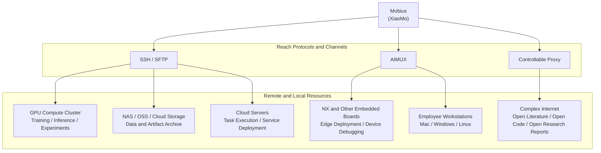

<a id="readme-top"></a>

<h1 align="center">
  <a href="https://mobius.nutshellai.cn/">
    
  </a>
  Mobius: A Self-Evolving Agent Operating System
</h1>

<p align="center">
  <a href="https://mobius.nutshellai.cn/"><strong>Official Website</strong></a>
  ·
  <sub><a href="./README.zh.md">简体中文</a> · <b>English</b></sub>
</p>


> Trying to build a once-and-for-all perfect AI Harness system is, like trying to find the end of a Möbius strip, ultimately futile.
>
> Here we present Mobius — as far as we know, the world's first **self-evolving** open-source Agent operating system, an AI workbench that can continuously self-iterate according to personalized needs.
>
> Open source shapes "Mobius AI" today; **and you — the true AI wielder, the breaker who is not satisfied with "pre-made" AI systems — can issue commands via natural language and screenshots, refine every edge of "Mobius AI" to your will, forge every line of code and every pixel, and build an unstoppable Agent operating system.**

<p align="center">
  
</p>


## A Growing, Evolvable Productivity System

Developing projects, processing data, optimizing frontends, reproducing paper experiments, embedded R&D, cross-device team collaboration, cloud server management, Deep Research, Auto Research ...
All of these can be done in one stop inside "Mobius AI". Here, the role shifts from AI user to Agent commander: any number of **development projects**, any number of **servers / PCs / embedded devices**, any number of ordinary tasks (Issues) and research tasks (Research) — with a single sentence, an idea immediately takes root in the right place.

And these are only the foundational capabilities of "Mobius AI".
In the wave of rapidly accelerating model capabilities, no matter how complete an Agent framework is, it may be "swallowed" overnight by a breakthrough in model capability.
And as the true AI wielder and commander leading countless Agents, you do not need to wait for Agent developers and architects to prepare mass-market "pre-made dishes".
Inside "Mobius AI", the underlying permissions of the Agent operating system are entirely within grasp — how Agents are scheduled is for you to define.

<video controls src="https://mobius.nutshellai.cn/assets/v1/self-evolution.mp4" title="Title"></video>

"Open source visible, what you imagine is what you get" is another key highlight of Mobius: it is not a one-time-delivered AI tool, but a system that can continuously absorb, continuously replace, and continuously grow stronger in real use.
State needs in **natural language**,
or provide a **screenshot** telling "Mobius AI" where it falls short,
or throw out a **blog URL** telling "Mobius AI" today's trendiest Agent usage,
"Mobius AI" will do its best to **self-forge**,
quietly completing its self-evolution without affecting other in-progress work.
Every interaction with "Mobius AI" can replace a plank on this "Ship of Theseus", until it becomes the sharp tool of you (and the team you lead).

[Examples](docs/self-evo-demo.md) are being supplemented.

## Truly Auto Research Capability

Just writing articles is not enough — allying with multiple machines, running experiments on super GPU clusters, reproducing papers, that is the real Auto Research capability.

- "Mobius AI" commands multiple Agents to build an autonomous collaboration network

<p align="center">
  
</p>

- "Mobius AI" automatically plots research progress

<p align="center">
  
</p>

- "Mobius AI" does research

<video controls src="https://mobius.nutshellai.cn/assets/v1/research-back.mp4" title="Title"></video>

## XiaoMo Assistant: A Development and Management Hub Even High-Schoolers Can Use


- The "second frontend" and intelligence center of "Mobius AI"
  - Anything clickable on the interface, XiaoMo can do; things the frontend cannot do, XiaoMo can still do

- Voice reminders when tasks complete: a busy person needs a caring secretary
  - Web voice reminders
  - Mobile notification + voice reminders
  - Configurable reminder granularity

- Speak, XiaoMo handles it
  - Voice input supported
  - Deep thinking combined with fast thinking

- Multi-end interconnection, log in anytime
  - Web
  - PC Windows + MacOS (in development)
  - Mobile iOS + Android (in testing)

<p align="center">
  
</p>


<video controls src="https://serve.gptacademic.cn/publish/shared/video/334599/self-evolution-demo-v1.mp4" title="Title"></video>
↑ The demo video above was also produced by XiaoMo. For the prompt, refer to this [SKILL](skills/mobius-self-evo-demo/SKILL.md). The recording process had zero human participation, with minor flaws — we are replacing the material.

## Any Model, Any Coding Agent

Easily connect to the strongest open-source model GLM-5.2; GPT-5.5, Claude-Opus, and others are also supported.

<p align="center">
  
</p>


## From GPU Clusters to NX Dev Boards — the Neural Center's Tentacles Reach Everywhere

Mobius not only schedules browsers and terminals, it can also bring GPU clusters, NX dev boards, NAS / OSS, cloud servers, and employee workstations into the same task network. Through SSH / SFTP, AIMUX, and controllable proxies, XiaoMo can remotely configure environments, dispatch experiments, and collect logs and artifacts — turning compute, devices, and data into tentacles that Agents can invoke. Whether the task happens in a cloud datacenter or on an edge dev board, it can be uniformly perceived, orchestrated, and reviewed.



Inside project memory, detect and manage compute resources:
- Connect ordinary SSH (cloud servers, lightweight application servers, NAS, GPU clusters)
- One-click connect your personal PC (unconditional connection, whether Windows or MacOS — anything that can run Python)
- One-click connect embedded dev boards (drones, unmanned vehicles equipped with NX and other embedded devices)

<p align="center">
  
</p>

## Team Management

Whether you are a one-person army or working alongside human colleagues, "Mobius AI" makes team collaboration easier and more transparent.

<p align="center">
  
</p>
<p align="center">
  
</p>
<p align="center">
  
</p>

### Deployment

#### Option 1: Install and Run Inside a Container (All Operating Systems, Recommended)

```bash
# 1. Clone the repo (optional tip: fork first then clone, so that after self-evolution you can commit directly to your own repo)
git clone https://github.com/nutshellai-tech/mobius.git
cd mobius

# 2. Generate config (random key passwords; you can manually configure to skip this step)
python3 conf_prepare.py --docker && python3 conf_check.py --docker

# 3. Build the base image (environment only, no code)
docker build -t imac-mobius-base:latest -f deploy/Dockerfile . && docker build -t imac-mobius-exe:latest .

# 4. Launch
docker compose up
```

#### Option 2: Direct Deployment (Linux or MacOS)

```bash
# 1. Install necessary dependencies such as tmux git
sudo apt install tmux python3 git curl proxychains openssh-server build-essential

# 2. Install claude code and codex (either one is fine, but installing both is recommended)
npm install -g @anthropic-ai/claude-code @openai/codex

# 3. Clone the repo (optional tip: fork first then clone, so that after self-evolution you can commit directly to your own repo)
git clone https://github.com/nutshellai-tech/mobius.git
cd mobius

# 4. Generate and configure keys (will copy .env.default to .env and create random passwords)
python3 conf_prepare.py && python3 conf_check.py

# 5. Install project dependencies (frontend + backend)
cd ./mobius && npm install && cd ./frontend && npm install && cd ../..

# 6. Run
python3 start.py
```
