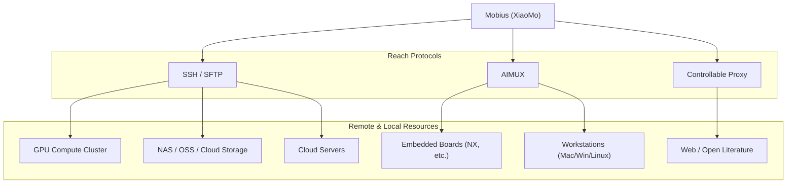

<p align="right">
  <a href="./README.md"><strong>English</strong></a>
  ·
  <a href="./README.zh.md"><strong>简体中文</strong></a>
</p>

<div align="center">

#  Mobius

<h3>
Open-source self-evolving productivity system<br />
One system to connect your team, AI agents, devices, and compute power
</h3>

<p align="center">
  <a href="https://github.com/nutshellai-tech/mobius"></a>
  <a href="https://github.com/nutshellai-tech/mobius"></a>
  <a href="https://github.com/nutshellai-tech/mobius"></a>
  <a href="https://github.com/nutshellai-tech/mobius"></a>
  <a href="https://github.com/nutshellai-tech/mobius"></a>
  <a href="https://github.com/nutshellai-tech/mobius"></a>
  <a href="https://github.com/nutshellai-tech/mobius"></a>
  <a href="https://github.com/nutshellai-tech/mobius/blob/main/LICENSE"></a>
  <a href="https://github.com/nutshellai-tech/mobius/stargazers"></a>
  <a href="https://github.com/nutshellai-tech/mobius/forks"></a>
  <a href="https://github.com/nutshellai-tech/mobius"></a>
</p>

<p align="center">
  <a href="https://mobius.nutshellai.cn/"><strong>Website</strong></a>
  ·
  <a href="https://nutshellai-tech.github.io/mobius/"><strong>Docs</strong></a>
</p>

</div>

<p align="center">
  
</p>

---

> **Trying to build a once-and-for-all perfect AI system is like trying to find the end of a Möbius strip — ultimately futile.**
>
> Mobius is the world's first **self-evolving** open-source Agent OS. Not a fixed toolbox — a growing productivity system you build your own Agent OS on, connecting projects, teams, models, devices, compute, and apps into one traceable workspace.

---

## Self-Evolving — The Ship of Theseus

Give Mobius a **change request**, a **screenshot**, or a **reference link** — it turns them into real code, UI, plugins, or workflow updates without disrupting your work. Every interaction replaces a plank on this Ship of Theseus, quietly in the background.

<video controls src="https://mobius.nutshellai.cn/assets/v1/self-evolution.mp4" title="Self-evolution demo"></video>

[More self-evolution examples](https://nutshellai-tech.github.io/mobius/self-evo-demo/)

---

## Auto Research with Multi-Agent Pipeline

Mobius orchestrates multiple agents into an autonomous research network — reading papers, extracting methods, reproducing experiments, and summarizing results. A research goal becomes a multi-agent pipeline, not just a Q&A.

<p align="center">
  
</p>

<p align="center">
  
</p>

<p align="center">
  <video controls src="https://github.com/user-attachments/assets/0580bbc1-3998-4a85-8fa1-189b46637289" width="700" title="Auto Research demo"></video>
</p>

---

## XiaoMo — AI Hub You Can Just Talk To

XiaoMo turns a complex agent system into a natural-language **interface**. Just talk to it: create projects, split tasks, launch agents, track progress. Anything clickable XiaoMo can do; things the frontend can't do, XiaoMo handles too. Voice input, multi-device (Web/PC/Mobile), configurable reminders.

<p align="center">
  
</p>

<p align="center">
  <video controls src="https://github.com/user-attachments/assets/f7a45ceb-b208-4d22-a77b-ff11c05ef497" width="700" title="XiaoMo demo"></video>
</p>

↑ This demo video was itself produced by XiaoMo — zero human participation in the recording.

---

## Any Model, Any Agent

Mobius is not locked into any single model. GPT, Claude, **GLM-5.2**, Codex — all can serve as execution engines inside the same project. Choose by task type, cost, and performance.

<p align="center">
  
</p>

---

## Connect Everything: GPU Clusters to Embedded Devices

Mobius schedules browsers and terminals — and beyond. GPU clusters, embedded boards, cloud servers, workstations all join the same task network through SSH, AIMUX, and controllable proxies.



<p align="center">
  
</p>

---

## Team Collaboration

Human members, AI agents, tasks, and deliverables in one view. Leads see who does what, where agents stand, what needs confirmation, where risks exist — no more fragmented communication.

<p align="center">
  
</p>

<p align="center">
  
</p>

<p align="center">
  
</p>

---

## Self-Incubating Extensions

Mobius ships with built-in extensions and can incubate new ones from your needs — financial news walls, PPT generators, research workbenches, World Cup portals. All generated with frontend, backend, data directory, and invocation entry, ready to keep evolving.

<table>
  <tr>
    <td width="50%">
      <strong>Immersive Web Experiences</strong><br />
      <sub>Turn visual ideas into runnable extension apps.</sub><br />
      
    </td>
    <td width="50%">
      <strong>Financial News Wall</strong><br />
      <sub>Track live market narratives and source-driven updates.</sub><br />
      
    </td>
  </tr>
  <tr>
    <td width="50%">
      <strong>World Cup Portal</strong><br />
      <sub>Build data-rich sports portals with schedules, news, players, and venues.</sub><br />
      
    </td>
    <td width="50%">
      <strong>PPT Maker</strong><br />
      <sub>Generate structured presentation assets from topics and materials.</sub><br />
      
    </td>
  </tr>
</table>

---

## Quick Start

Full deployment instructions at <a href="https://nutshellai-tech.github.io/mobius/">Docs</a>.

### Option 1: Containers (recommended)

```bash
git clone https://github.com/nutshellai-tech/mobius.git && cd mobius
python3 conf_prepare.py --docker && python3 conf_check.py --docker
docker build -t mobius-system-base:latest -f deploy/Dockerfile .
docker build -t mobius-system-exe:latest .
docker compose up
```

### Option 2: Direct (Linux / macOS)

```bash
sudo apt install tmux python3 git curl proxychains openssh-server build-essential
npm install -g @anthropic-ai/claude-code @openai/codex
git clone https://github.com/nutshellai-tech/mobius.git && cd mobius
python3 conf_prepare.py && python3 conf_check.py
cd ./mobius && npm install && cd ./frontend && npm install && cd ../..
python3 start.py
```

---

## Roadmap

- **v0.1** — Agent OS foundation: projects, issues, sessions, model integrations, agent execution, task management
- **v0.2** — Team collaboration: multi-user projects, permissions, task status, agent tracking, usage analytics
- **v0.3** — Self-evolution & extensions: plugin incubation, knowledge accumulation, feedback-driven iteration
- **v0.4** — XiaoMo & multi-agent: natural-language interface, task decomposition, sub-agent collaboration, progress summaries
- **v0.5** — Unify users, AI, devices, compute: remote compute, device access, robot/terminal integration, research pipelines

### Contribution

Issues, plugins, docs, bugs, use cases — all welcome. If you believe AI systems should evolve instead of being preset tools, join us.

<p align="center">
  <a href="https://github.com/nutshellai-tech/mobius">GitHub</a>
  ·
  <a href="https://mobius.nutshellai.cn/">Website</a>
  ·
  <a href="https://nutshellai-tech.github.io/mobius/">Docs</a>
</p>
