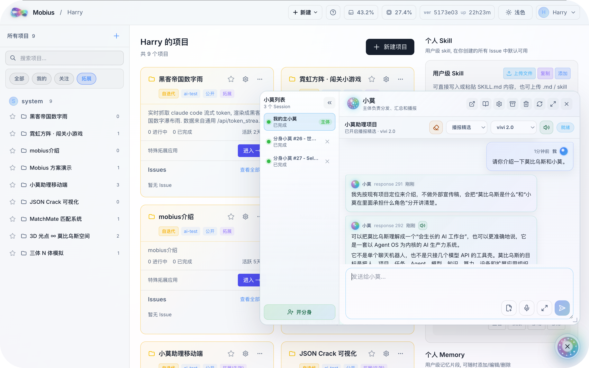
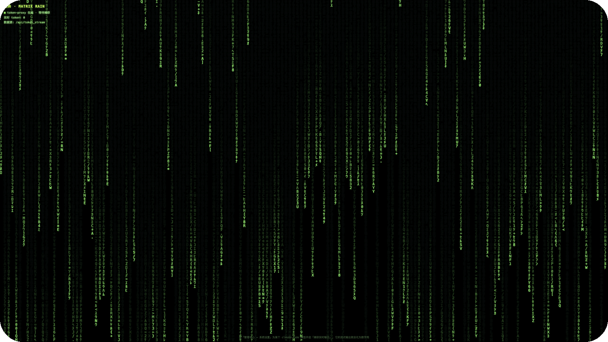
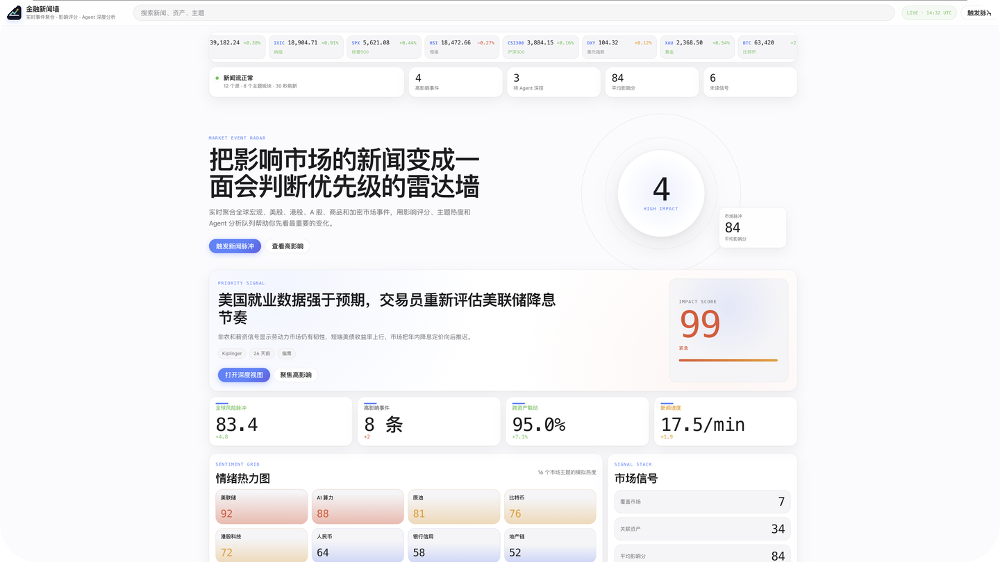
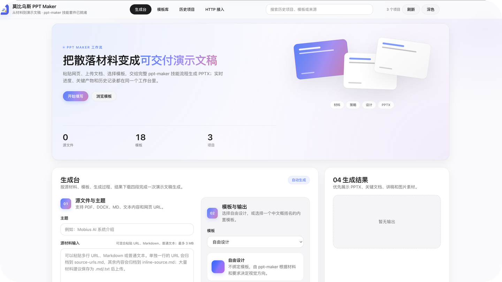

<p align="right">
  <a href="./README.md"><strong>English</strong></a>
  ·
  <a href="./README.zh.md"><strong>简体中文</strong></a>
</p>

<div align="center">

#  莫比乌斯

<h3>
开源的自进化生产力系统<br />
人机物智算协同的超级智能体系统
</h3>

<p align="left">
Mobius 是据我们所知全球首个<strong>自进化的开源智能体操作系统</strong>：一个能够按照个性化需求持续自我迭代的 AI 工作台。它不是固定形态的工具箱，而是一个<strong>会生长、会进化的生产力系统</strong>；你可以基于 Mobius 构建属于自己的 Agent OS，把项目、团队、模型、知识、设备、算力和业务应用组织成同一个可追踪的工作面。利用 Mobius，<strong>仅通过一句话</strong>，就可以将你的一切通过莫比乌斯联系并“AI 起来”。这个“一切”包括你和你的团队、你的专属智能体、你的移动终端设备、你的远程算力平台，甚至是你的硬件机器人。你有什么，都可以加到莫比乌斯中。
</p>

<p align="center">
  <a href="https://github.com/nutshellai-tech/mobius"></a>
  <a href="https://github.com/nutshellai-tech/mobius"></a>
  <a href="https://github.com/nutshellai-tech/mobius"></a>
  <a href="https://github.com/nutshellai-tech/mobius"></a>
  <a href="https://github.com/nutshellai-tech/mobius"></a>
  <a href="https://github.com/nutshellai-tech/mobius"></a>
  <a href="https://github.com/nutshellai-tech/mobius"></a>
  <a href="https://github.com/nutshellai-tech/mobius/blob/main/LICENSE"></a>
  <a href="https://github.com/nutshellai-tech/mobius/stargazers"></a>
  <a href="https://github.com/nutshellai-tech/mobius/forks"></a>
  <a href="https://github.com/nutshellai-tech/mobius"></a>
</p>

<p align="center">
  <a href="https://mobius.nutshellai.cn/"><strong>官网网站</strong></a>
  ·
  <a href="https://nutshellai-tech.github.io/mobius/"><strong>使用文档</strong></a>
  ·
  <a href="./WHAT_WE_WANT_TO_SAY.zh.md"><strong>我们想说的</strong></a>
</p>

</div>

<p align="center">
  
</p>

---

## 为什么使用莫比乌斯？

> <strong>试图打造一劳永逸的完美 AI Harness 系统，就如试图寻找莫比乌斯环的尽头一样，终究“徒劳无功”。</strong>

现有很多 Agent 框架仍然停留在<strong>“调用模型”和“编排流程”</strong>的层面：它们可以完成一次任务，却很难把每一次真实使用沉淀为系统能力；它们可以接入工具，却常常缺少项目、团队、设备、算力和知识资产之间的统一任务面；它们能让 Agent 工作，却未必能让人真正掌控 Agent 编队。

Mobius 正是为了解决这些问题而诞生。它把 <strong>Agent OS、项目系统、任务系统、模型引擎、扩展应用和自我迭代机制</strong>放在一起，让 AI 不只是回答问题，而是持续参与真实生产、持续吸收反馈、持续进化为更适合你和团队的系统。

### 1. <strong>会生长、可进化</strong>

莫比乌斯可以根据用户需求不断修改自身，也可以自动追踪最前沿技术，根据用户偏好进行自我迭代。你提出一个改动、给一张截图、发一个参考链接，它都可以转化为真实的代码、界面、插件或工作流更新。

<p>
  <sub><strong>对应小手册：</strong>
    <a href="https://nutshellai-tech.github.io/mobius/self-evo-demo/">简单自进化示例</a>
    · <a href="https://nutshellai-tech.github.io/mobius/tutorial/13_xiaomo_control_hub/">万能捷径：小莫助理</a>
    · <a href="https://nutshellai-tech.github.io/mobius/tutorial/16_change_frontend_theme/">修改前端色彩主题</a>
  </sub>
</p>

### 2. <strong>人-机-物-智-算协同</strong>

莫比乌斯用 Agent OS 作为内核，把五个要素组织进同一系统：人提出目标和判断；机承载开发、调试和部署；物负责物理世界的观测与执行；智组织任务和执行；算提供计算资源。五者在莫比乌斯中形成可追踪、可复盘、可持续成长的协同关系。

<p>
  <sub><strong>对应小手册：</strong>
    <a href="https://nutshellai-tech.github.io/mobius/tutorial/04_add_remote_server/">添加远程算力</a>
    · <a href="https://nutshellai-tech.github.io/mobius/tutorial/02a_import_project_and_begin_first_job/">导入项目并开启首个任务</a>
    · <a href="https://nutshellai-tech.github.io/mobius/tutorial/03a_using_skill_and_memory/">技能与记忆</a>
  </sub>
</p>

### 3. <strong>智能小莫，方便易用</strong>

莫比乌斯的智能小莫，将复杂的超级 Agent 系统收束成一个小学生也能使用的自然语言入口。用户只需要跟小莫聊天，就能调用各类资源完成复杂任务：创建项目、拆解任务、启动 Agent、查询进度、总结结果、提醒关键事项。

<p>
  <sub><strong>对应小手册：</strong>
    <a href="https://nutshellai-tech.github.io/mobius/tutorial/13_xiaomo_control_hub/">万能捷径：小莫助理</a>
    · <a href="https://nutshellai-tech.github.io/mobius/tutorial/05_using_xiaomo_assistant/">小莫助手 Web 端</a>
    · <a href="https://nutshellai-tech.github.io/mobius/tutorial/14_chat_input_tips/">聊天输入小技巧</a>
  </sub>
</p>

---

## 其他亮点

### 4. <strong>人与多 Agent 协作</strong>

莫比乌斯可以自动将复杂任务拆解，动态分派给多个 Agent。多个 Agent 可以围绕同一个目标异步协作，分别承担调研、开发、测试、设计、文档、审查等角色，稳步推进任务直至完成。所有 Agent 的活动均可实时追踪和干预。

<p>
  <sub><strong>对应小手册：</strong>
    <a href="https://nutshellai-tech.github.io/mobius/tutorial/13_xiaomo_control_hub/">万能捷径：小莫助理</a>
    · <a href="https://nutshellai-tech.github.io/mobius/tutorial/02a_import_project_and_begin_first_job/">并行会话与项目任务</a>
    · <a href="https://nutshellai-tech.github.io/mobius/tutorial/08_monitor_agents/">监控智能体</a>
    · <a href="https://nutshellai-tech.github.io/mobius/tutorial/06_prevent_agent_idle/">防止 Agent 偷懒</a>
    · <a href="https://nutshellai-tech.github.io/mobius/tutorial/20_research_agent_team/">组建智能体研究团队</a>
  </sub>
</p>

### 5. <strong>人类团队协作支持</strong>

莫比乌斯把人类成员、AI Agent、项目任务和交付结果放进同一个协作视图。团队负责人可以看到谁在做什么、Agent 进展到哪里、哪些结果等待确认、哪里存在风险，从而减少反复追问、手动同步和碎片化沟通。

<p>
  <sub><strong>对应小手册：</strong>
    <a href="https://nutshellai-tech.github.io/mobius/tutorial/01_add_user/">添加用户</a>
    · <a href="https://nutshellai-tech.github.io/mobius/tutorial/08_monitor_agents/">监控智能体</a>
    · <a href="https://nutshellai-tech.github.io/mobius/tutorial/17_favorite_project/">标记重点项目</a>
    · <a href="https://nutshellai-tech.github.io/mobius/tutorial/03a_using_skill_and_memory/">项目级 Skill 与 Memory</a>
    · <a href="https://nutshellai-tech.github.io/mobius/tutorial/12_migrate_skill_memory/">迁移 Skill 和 Memory</a>
  </sub>
</p>

### 6. <strong>任意 AI 模型兼容</strong>

莫比乌斯不押注单一模型，也不只是简单接入 API。GPT、Claude、GLM、Codex 以及未来更多模型，都可以作为不同 Agent 的执行引擎进入项目、任务、上下文和交付流程，让用户按任务类型、成本、性能和部署环境灵活选择。

<p>
  <sub><strong>对应小手册：</strong>
    <a href="https://nutshellai-tech.github.io/mobius/tutorial/09_config_codex_model/">配置 Codex + 模型</a>
    · <a href="https://nutshellai-tech.github.io/mobius/tutorial/10_config_claude_code_model/">配置 Claude Code + 模型</a>
    · <a href="https://nutshellai-tech.github.io/mobius/tutorial/15_switch_model_mid_session/">中途切换模型</a>
    · <a href="https://nutshellai-tech.github.io/mobius/tutorial/11_limit_model_usage/">限制模型调用频率</a>
  </sub>
</p>

### 7. <strong>自孵化拓展</strong>

莫比乌斯既带有内置拓展应用，也可以根据用户需求孵化新的 App。金融新闻墙、PPT 生成器、科研工作台、世界杯专题页、团队内部工具，都可以通过扩展系统生成前端、后端 handler、数据目录和调用入口，并继续被使用、迭代和组合。

<table>
  <tr>
    <td width="50%">
      <strong>沉浸式网页体验</strong><br />
      <sub>把视觉创意直接变成可运行的扩展应用。</sub><br />
      
    </td>
    <td width="50%">
      <strong>金融新闻墙</strong><br />
      <sub>追踪实时市场叙事和来源驱动的新闻更新。</sub><br />
      
    </td>
  </tr>
  <tr>
    <td width="50%">
      <strong>世界杯专题站</strong><br />
      <sub>构建包含赛程、新闻、球员和球场的数据型体育门户。</sub><br />
      
    </td>
    <td width="50%">
      <strong>PPT Maker</strong><br />
      <sub>从主题和材料生成结构化演示资产。</sub><br />
      
    </td>
  </tr>
</table>

---

## 使用莫比乌斯可以做什么？

### 1. 搭建自己的 Agent OS

把模型、Agent、Skill、Memory、项目、设备和算力统一接入 Mobius，形成属于你自己的 AI 工作台。它不是一个一次性聊天窗口，而是可以持续运行、持续迭代、持续沉淀经验的生产系统。

- <strong>个人工作台</strong>：把常用模型、私人知识库、日程、文件、开发环境和远程机器组织到一个入口里。
- <strong>团队工作台</strong>：把成员、项目、Issue、Agent 分身和交付记录统一到同一套协作界面。
- <strong>行业工作台</strong>：围绕金融、科研、教育、硬件、运营等场景，把专用工具和工作流沉淀为可复用插件。
- <strong>长期记忆与项目知识</strong>：把个人偏好、项目背景、交付记录和团队规范沉淀为下一次任务可直接调用的上下文。

### 2. 团队开发与项目管理

用自然语言创建项目、拆任务、分配 Agent、跟踪状态、检查风险和汇总结果。开发者可以让 Agent 修 bug、做前端、写后端、跑测试；负责人可以查看项目进展、交付质量和协作记录。

- <strong>需求到代码</strong>：把一句需求拆成前端、后端、数据、测试、部署多个子任务，由不同 Agent 并行推进。
- <strong>项目例会替代</strong>：让小莫自动汇总本周进展、阻塞点、风险和下一步，减少手动同步。
- <strong>代码审查与回归</strong>：让一个 Agent 实现，另一个 Agent 审查，再由测试 Agent 补充验证。
- <strong>团队经验复用</strong>：把复盘、规范、最佳实践和历史决策保留下来，让新成员和新 Agent 都能快速进入状态。

### 3. 快速生成 Demo、插件与业务应用

你可以让小莫直接创建一个插件、一个网页、一个专题站、一个内部工具或一个数据看板。Mobius 会把需求拆成代码、资源、后端接口和运行入口，最终沉淀为可以继续使用的扩展应用。

- <strong>演示型产品</strong>：一句话生成活动页、发布页、产品介绍页、赛事专题页或投资人演示 Demo。
- <strong>内部运营工具</strong>：生成数据录入、内容审核、客户跟进、日报周报、知识检索等轻量应用。
- <strong>可持续迭代插件</strong>：先做能用的版本，再让小莫根据截图、反馈和真实使用继续优化。

### 4. 深度科研、竞品研究与 Auto Research

Mobius 可以把论文阅读、资料调研、实验复现、代码检查、结果总结和价值判断组织成可追踪的研究流程。研究目标不再只是一次问答，而可以展开成一支 Agent 研究组和一条可复盘的科研流水线。

- <strong>论文阅读</strong>：让研究 Agent 深读论文、抽取方法、复现实验思路，并判断对当前项目的启发。
- <strong>竞品扫描</strong>：持续追踪产品、论文、开源项目和行业新闻，把可借鉴点写回知识库。
- <strong>科研流水线</strong>：从选题、资料、代码、实验到总结，每一步都有上下文、有记录、可追问。

### 5. 连接真实设备、远程算力与物理世界

Mobius 可以把本地机器、远程服务器、GPU 集群、移动终端，甚至传感器和机器人纳入同一任务系统。用户提出目标，系统负责组织真正能执行任务的环境与资源。

- <strong>远程开发与部署</strong>：把本地笔记本、云服务器、GPU 机器和测试环境纳入同一项目上下文。
- <strong>移动端跟进</strong>：在手机上查看 Agent 进展、补充指令、确认风险动作或接收关键提醒。
- <strong>机器人与硬件接入</strong>：把传感器、执行器、实验设备或机器人封装为可调用资源，让 AI 任务真正进入物理世界。

### 6. 打造会自我改进的产品系统

Mobius 的关键不是“让 AI 做一次事”，而是让系统在真实使用中持续变好。你可以让它观察自己的不足、参考前沿论文和优秀产品、生成改进方案，并把方案落实到代码和体验中。

- <strong>自我修复</strong>：发现页面错误、交互断点、数据过期或 Agent 失败后，直接让小莫定位并修复。
- <strong>自我扩展</strong>：从一个需求孵化出新插件、新 API、新工作流或新的 Agent 角色。
- <strong>自我优化</strong>：让系统根据使用记录、用户反馈和外部资料不断调整产品形态。

---

## 快速开始

详细部署说明请参考 [使用文档](https://nutshellai-tech.github.io/mobius/) 和 [我们想说的](./WHAT_WE_WANT_TO_SAY.zh.md)。下面保留最常用的两种启动方式。

### 方式一：容器中安装和运行（推荐）

```bash
# 1. 克隆仓库
git clone https://github.com/nutshellai-tech/mobius.git
cd mobius

# 2. 生成配置
python3 conf_prepare.py --docker && python3 conf_check.py --docker

# 3. 构建镜像
docker build -t mobius-system-base:latest -f deploy/Dockerfile .
docker build -t mobius-system-exe:latest .

# 4. 启动
docker compose up
```

### 方式二：直接部署（Linux / macOS）

```bash
# 1. 安装必要依赖
sudo apt install tmux python3 git curl proxychains openssh-server build-essential

# 2. 安装 Agent 执行引擎
npm install -g @anthropic-ai/claude-code @openai/codex

# 3. 克隆仓库
git clone https://github.com/nutshellai-tech/mobius.git
cd mobius

# 4. 生成并检查配置
python3 conf_prepare.py && python3 conf_check.py

# 5. 安装前后端依赖
cd ./mobius && npm install
cd ./frontend && npm install
cd ../..

# 6. 运行
python3 start.py
```

---

## RoadMap 和 Contribution

### RoadMap

- <strong>v0.1 - Agent OS 基础工作台</strong>：项目、Issue、Session、模型接入、Agent 执行与基础任务管理。
- <strong>v0.2 - 团队协作与管理视图</strong>：多人项目、权限、任务状态、Agent 贡献追踪、团队 AI 使用分析。
- <strong>v0.3 - 自进化与扩展系统</strong>：插件孵化、前后端扩展、项目知识沉淀、使用反馈驱动系统迭代。
- <strong>v0.4 - 智能小莫与多 Agent 协作</strong>：自然语言入口、任务拆解、分身协作、进度汇总和关键结果提醒。
- <strong>v0.5 - 人机物智算协同</strong>：远程算力、设备接入、机器人/终端联动、科研与工程任务流水线。

### Contribution

Mobius 仍在快速生长。我们欢迎开发者、研究者、设计师、产品负责人和真实用户一起参与：提交 Issue、提出需求、贡献插件、改进文档、报告 bug、分享使用案例，或者直接帮助 Mobius 进化它自己。

当前主要贡献者与维护身份包括：

- Nutshell.AI / 果壳智算团队
- NutyHenry
- Mobius OS contributors

如果你认同“AI 系统不应该只是预制工具，而应该成为可持续进化的生产力系统”，欢迎加入 Mobius 的构建。

<p align="center">
  <a href="https://github.com/nutshellai-tech/mobius">GitHub</a>
  ·
  <a href="https://mobius.nutshellai.cn/">Website</a>
  ·
  <a href="https://nutshellai-tech.github.io/mobius/">Docs</a>
</p>
