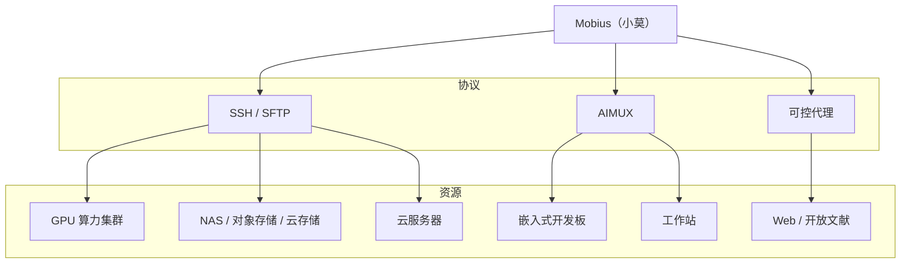

<p align="right">
  <a href="./README.md"><strong>English</strong></a>
  ·
  <a href="./README.zh.md"><strong>简体中文</strong></a>
</p>

<div align="center">

#  Mobius

<h3>
首个自进化的开源 Agent OS<br />
一个系统，连接你的团队、AI 智能体、设备与算力
</h3>

<p align="center">
  <a href="https://github.com/nutshellai-tech/mobius/stargazers"></a>
  <a href="https://github.com/nutshellai-tech/mobius"></a>
  <a href="https://mobius.nutshellai.cn/"></a>
  <a href="https://nutshellai-tech.github.io/mobius/"></a>
</p>

</div>

<p align="center">
  
</p>


> **模型飞速进步的时代，试图打造适合所有人的完美的 AI 系统，就像寻找莫比乌斯环的尽头，终究徒劳无功。**
>
> Mobius 是全球首个**自进化**的开源 Agent OS，一个持续生长的生产力系统，把项目、团队、模型、设备、算力和应用连成一个可追溯的工作空间。


## 最新动态

**2026-07-16**
- **网页终端新增两种打开方式**：可在当前项目目录打开普通 shell，也可打开终端后自动 attach 到当前会话的 Agent tmux 后台，直接查看 Agent TUI 运行状态。查看更新后的[网页终端教程](https://nutshellai-tech.github.io/mobius/tutorial/26_web_terminal/)。

**2026-07-14**
- **代码对话 v2**工作空间模式：三栏布局（文件浏览器 + 内置 CodeMirror 编辑器，支持语法高亮与就地保存 + 对话），可在一个界面浏览、编辑、讨论项目文件。
- 为管理中心、研究课题页、自我认知工作台新增**场景级首触引导**。


## 自进化

Mobius 会根据你的输入改写自身。发一个**修改需求**、一张**截图**，或一个**参考链接**——Mobius 把它们变成真实的代码、界面、插件或流程更新，全程不打断你的工作。每一次迭代，都在后台悄悄替换"忒修斯之船"上的一块木板。

<p align="center">
  
</p>

[查看自进化示例](https://nutshellai-tech.github.io/mobius/self-evo-demo/)


## 自动科研

Mobius 把多个智能体编排成一条自主科研流水线——读论文、抽取方法、跑实验、汇总结果。一个科研目标变成一个多智能体系统，而不是一次单轮问答。

<p align="center">
  
</p>


## 小莫（XiaoMo）

小莫是整个系统的自然语言入口。直接对它说：创建项目、拆分任务、启动智能体、追踪进度。界面上能点的，小莫都能做；界面做不到的，小莫也能处理。支持语音输入、多端（Web、PC、移动端）和可配置的提醒。

<p align="center">
  
</p>

> 本页的演示素材均由小莫自己制作，录制过程零人工参与。


## 任意模型，任意智能体

Mobius 与具体模型解耦。GPT、Claude、**GLM-5.2**、Codex——都可以作为同一个项目里的执行引擎。按任务类型、成本或性能自由选择。


## 连接一切

Mobius 在同一个任务网络里调度浏览器、终端、GPU 集群、嵌入式开发板、云服务器和工作站。

通过 SSH、AIMUX 和可控代理访问你的资源：




## 团队协作

成员、智能体、任务和交付物集中在同一个视图。负责人一眼看到谁在做什么、每个智能体在哪、哪些需要确认、风险在哪里——不再有碎片化的沟通。

<p align="center">
  
</p>


## 自孵化拓展

Mobius 自带内置拓展，并按你的需求生长出新的——金融看板、PPT 生成器、科研工作台、实时门户。每个拓展都自带前端、后端 handler、数据目录和调用入口，可持续进化。

<p align="center">
  
</p>

<table>
  <tr>
    <td width="50%">
      <strong>沉浸式 Web 体验</strong><br />
      <sub>把视觉创意变成可运行的拓展应用。</sub><br />
      
    </td>
    <td width="50%">
      <strong>金融新闻墙</strong><br />
      <sub>追踪实时市场叙事。</sub><br />
      
    </td>
  </tr>
  <tr>
    <td width="50%">
      <strong>世界杯门户</strong><br />
      <sub>数据丰富的体育门户。</sub><br />
      
    </td>
    <td width="50%">
      <strong>PPT 生成器</strong><br />
      <sub>从主题和素材生成演示文稿。</sub><br />
      
    </td>
  </tr>
</table>


## 快速开始

完整部署指南见[文档](https://nutshellai-tech.github.io/mobius/)。

### 容器（推荐）

```bash
# 1. 克隆仓库（建议先 fork 再 clone，这样自进化后可以直接提交到自己的仓库）
git clone https://github.com/nutshellai-tech/mobius.git && cd mobius

# 2. 生成配置（随机密钥/密码；也可手动配置以跳过此步）
python3 conf_prepare.py --docker && python3 conf_check.py --docker

# 3. 构建镜像（base 镜像仅含环境，不含代码）
docker build -t mobius-system-base:latest -f deploy/Dockerfile .
docker build -t mobius-system-exe:latest .

# 4. 启动
docker compose up
```

### 直接部署（Linux / macOS）

```bash
# 1. 安装前置依赖（tmux、git 等）
sudo apt install tmux python3 git curl proxychains openssh-server build-essential

# 2. 安装编码 Agent（任选其一，建议两者都装）
npm install -g @anthropic-ai/claude-code @openai/codex

# 3. 克隆仓库（建议先 fork 再 clone，这样自进化后可以直接提交到自己的仓库）
git clone https://github.com/nutshellai-tech/mobius.git && cd mobius

# 4. 生成并校验配置（会把 .env.default 复制为 .env 并生成随机密码）
python3 conf_prepare.py && python3 conf_check.py

# 5. 安装依赖（前端 + 后端）
cd ./mobius && npm install && cd ./frontend && npm install && cd ../..

# 6. 运行
python3 start.py
```


## 路线图

我们正在构建的下一步：

- **移动端 App** — 在 iOS 和 Android 上带来小莫与完整的 Agent 控制
- **桌面端 App** — 一个原生连接器，把 PC 设备（Windows、macOS、Linux）接入 Mobius
- **拓展市场** — 发现、分享和安装社区拓展
- **多语言与本地化** — 把界面和文档本地化为更多语言

### 参与贡献

Issue、插件、文档、Bug 报告、使用案例——皆欢迎。如果你认同 AI 系统应当持续进化、而非静态工具，欢迎加入我们。

<p align="center">
  <a href="https://github.com/nutshellai-tech/mobius">GitHub</a>
  ·
  <a href="https://mobius.nutshellai.cn/">Website</a>
  ·
  <a href="https://nutshellai-tech.github.io/mobius/">Docs</a>
</p>
