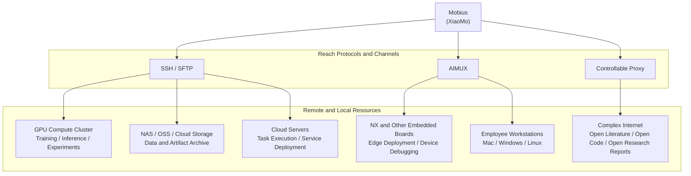

# From GPU Clusters to NX Dev Boards, the Neural Center’s Tentacles Reach Everywhere

Mobius not only schedules browsers and terminals, it can also bring GPU clusters, NX dev boards, NAS / OSS, cloud servers, and employee workstations into the same task network. Through SSH / SFTP, AIMUX, and controllable proxies, XiaoMo can remotely configure environments, dispatch experiments, and collect logs and artifacts, turning compute, devices, and data into tentacles that Agents can invoke. Whether the task happens in a cloud datacenter or on an edge dev board, it can be uniformly perceived, orchestrated, and reviewed.

Inside project memory, detect and manage compute resources:

- Connect ordinary SSH resources, including cloud servers, lightweight application servers, NAS, and GPU clusters
- One-click connect your personal PC, without conditional network restrictions, as long as it can run Python, whether Windows or macOS
- One-click connect embedded dev boards, such as drones and unmanned vehicles equipped with NX and other embedded devices

  

[Back to README](../../README.md)
