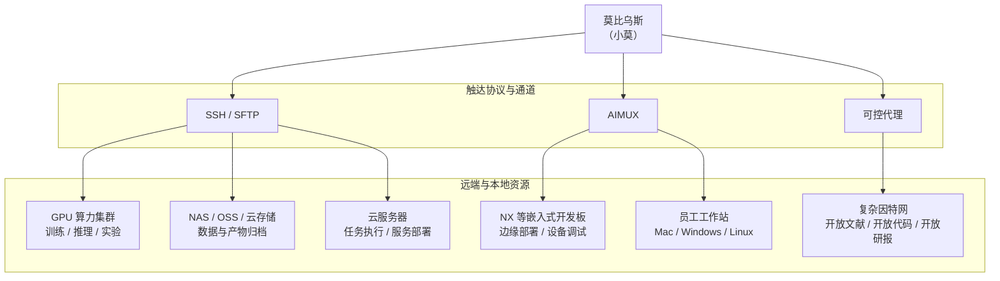

# 从 GPU 集群到 NX 开发板，神经中枢的触手，无处不可达

莫比乌斯不仅调度浏览器和终端，也可以把 GPU 集群、NX 开发板、NAS/OSS、云服务器与员工工作站纳入同一个任务网络。通过 SSH/SFTP、AIMUX 和可控代理，小莫可以远程配置环境、下发实验、回收日志与产物，让算力、设备和数据都成为可被 Agent 调用的触手。无论任务发生在云端机房，还是一块边缘开发板上，都能被统一感知、编排和复盘。

在项目记忆中，侦测和管理计算资源：

- 连接普通 SSH（云服务器，轻量应用服务器，NAS，GPU 集群）
- 一键连接自己的个人 PC（无条件连接，无论是 Windows，macOS，能运行 Python 即可）
- 一键连接嵌入式开发板（搭载 NX 等嵌入式设备的无人机、无人车等）

  

[返回中文 README](../../README.zh.md)
